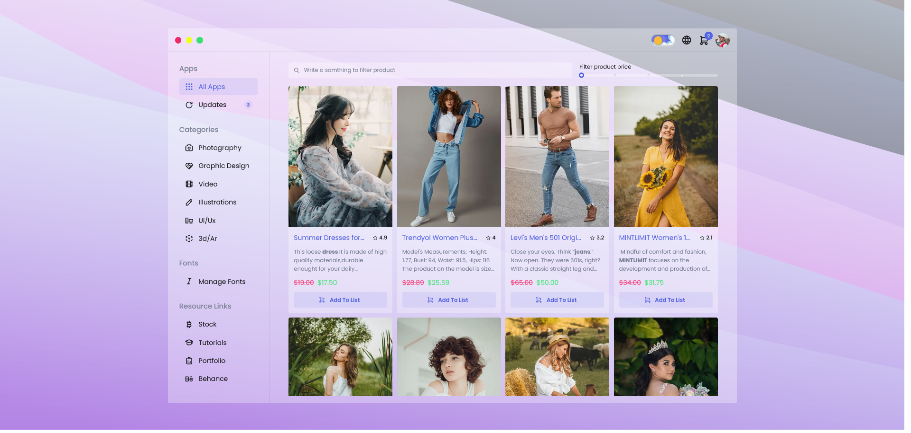

An Online Shop site template, implemented with [Next.js](https://nextjs.org/) and [Mantine UI](https://mantine.dev/). Styled with [Post CSS](https://postcss.org/). This is one of my portfolios, but I would be pleased if these codes helped others, so I published it as an open-source project. feel free to explore it, and if you need help, ask me. I would respond as soon as possible.

  To support me, please create
  <strong>Pull request</strong>
  and give <strong>star⭐</strong>
  to this repository.
   
  I appreciate your support in advance. ❤

&nbsp;
&nbsp;
&nbsp;
&nbsp;
&nbsp;

[Technologies](#-technologies) •
[Demo](#-demo) •
[Features](#-features) •
[Pages](#-pages) •
[Contributing](#-contributing) •
[Links](#-links)

## 🔧 Technologies

&nbsp;
&nbsp;

&nbsp;

## ✨ Demo

You can visit and explore online shop in the [Elixir Online Shop](https://elixir-online-shop.vercel.app/) template.

## 🔥 Features

- Using Mantine UI
- Using Framer Motion
- Using Clerk Auth
- Using Swell Storfront
- Using SWR
- Using Postcss with Plugins
- Using Clsx
- Fully responsive
- Real Products with Locale Data
- Search, Filter Actions with Infinite Scrolling
- Color Scheme Switch
- Multi Theme Colors Support
- Multi Languages Support
- Linting with Eslint and Stylelint
- Format with Prettier
- Husky and Lint-staged for Pre-committing
- Npm Package Manager

## 📃 Pages

- Main (index)
- Product
- Sign In
- Sign UP
- User Account

(<a href="#top">BACK TO TOP 🔝</a>)

## 🤝 Contributing

Contributions are what make the open source community such an amazing place to learn, inspire, and create. Any contributions you make are **greatly appreciated**.

If you have a suggestion that would make this better, please fork the repo and create a pull request. You can also simply open an issue with the tag "enhancement".
Don't forget to give the project a star! Thanks again!

1. Fork the Project
2. Create your Feature Branch (`git checkout -b feature/AmazingFeature`)
3. Commit your Changes (`git commit -m 'Add some AmazingFeature'`)
4. Push to the Branch (`git push origin feature/AmazingFeature`)
5. Open a Pull Request

## 🔗 Links

  
  
  

(<a href="#top">BACK TO TOP🔝</a>)

